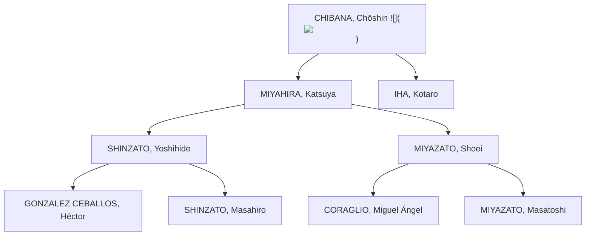

```mermaid
graph TD;

CHIBANA["`CHIBANA, Chōshin ![](<img src=chibana.png width=100/>)`"];
MIYAHIRA["MIYAHIRA, Katsuya"];
SHINZATO["SHINZATO, Yoshihide"];
SHINZATO2["SHINZATO, Masahiro"];
GONZALEZCEBALLOS["GONZALEZ CEBALLOS, Héctor"];
MIYAZATO["MIYAZATO, Shoei"];
MIYAZATO2["MIYAZATO, Masatoshi"]
CORAGLIO["CORAGLIO, Miguel Ángel"]
IHA["IHA, Kotaro"]

CHIBANA --> MIYAHIRA;
CHIBANA --> IHA;
MIYAHIRA --> SHINZATO;
SHINZATO --> GONZALEZCEBALLOS;
SHINZATO --> SHINZATO2;
MIYAHIRA --> MIYAZATO;
MIYAZATO --> CORAGLIO
MIYAZATO --> MIYAZATO2
```


* ```CHIBANA[CHIBANA, Chōshin ];```
* ```CHIBANA[CHIBANA, Chōshin ];```
* ```CHIBANA[CHIBANA, Chōshin ()];```
* ```CHIBANA[`CHIBANA, Chōshin `];```

