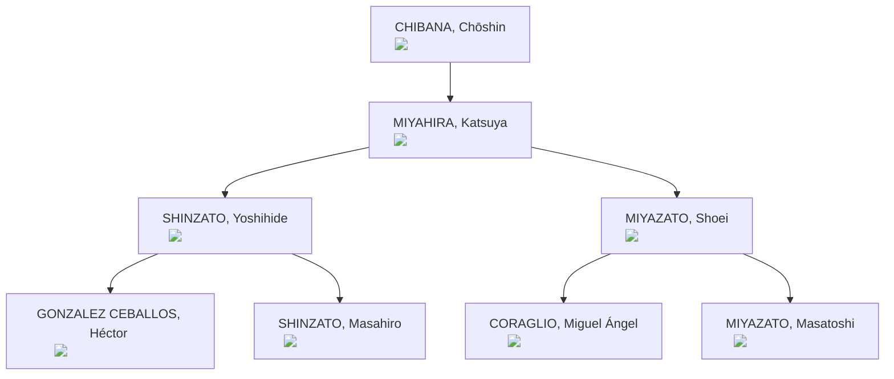

```mermaid
graph TD;

CHIBANA["CHIBANA, Chōshin <img src=https://raw.githubusercontent.com/jmdz/karate-notes/main/chibana.png style='margin: auto; max-width: 140px;' />"];
MIYAHIRA["MIYAHIRA, Katsuya <img src=https://raw.githubusercontent.com/jmdz/karate-notes/main/miyahira.png style='margin: auto; max-width: 140px;' />"];
SHINZATO["SHINZATO, Yoshihide <img src=https://raw.githubusercontent.com/jmdz/karate-notes/main/shinzato.png style='margin: auto; max-width: 140px;' />"];
SHINZATO2["SHINZATO, Masahiro <img src=https://raw.githubusercontent.com/jmdz/karate-notes/main/shinzato2.png style='margin: auto; max-width: 140px;' />"];
GONZALEZCEBALLOS["GONZALEZ CEBALLOS, Héctor <img src=https://raw.githubusercontent.com/jmdz/karate-notes/main/gonzalezceballos.png style='margin: auto; max-width: 140px;' />"];
MIYAZATO["MIYAZATO, Shoei <img src=https://raw.githubusercontent.com/jmdz/karate-notes/main/miyazato.png style='margin: auto; max-width: 140px;' />"];
MIYAZATO2["MIYAZATO, Masatoshi <img src=https://raw.githubusercontent.com/jmdz/karate-notes/main/miyazato2.png style='margin: auto; max-width: 140px;' />"]
CORAGLIO["CORAGLIO, Miguel Ángel <img src=https://raw.githubusercontent.com/jmdz/karate-notes/main/coraglio.png style='margin: auto; max-width: 140px;' />"]

CHIBANA --> MIYAHIRA;
MIYAHIRA --> SHINZATO;
SHINZATO --> GONZALEZCEBALLOS;
SHINZATO --> SHINZATO2;
MIYAHIRA --> MIYAZATO;
MIYAZATO --> CORAGLIO
MIYAZATO --> MIYAZATO2
```
