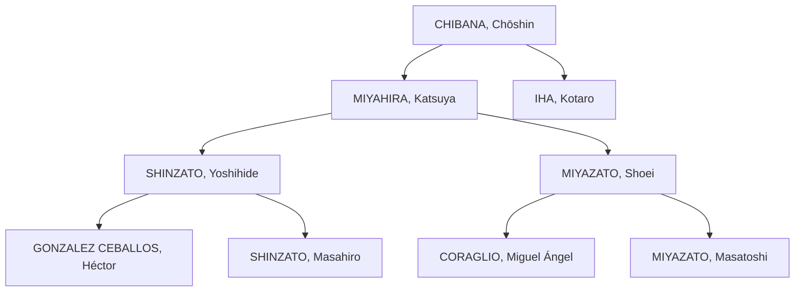

# Linaje

* CHIBANA, Chōshin (知花 朝信) [1885–1969]: Shōrin-ryū.
    + https://en.wikipedia.org/wiki/Chōshin_Chibana
    + https://es.wikipedia.org/wiki/Chibana_Chōshin
    + https://pt.wikipedia.org/wiki/Choshin_Chibana

    * Shōrin-ryū (少林流): 1933 (nombrado por Chibana-hanshi). 少林 (shōrin) es "bosque pequeño", y 流 (ryū) es "escuela".
        + https://en.wikipedia.org/wiki/Shōrin-ryū
        + https://es.wikipedia.org/wiki/Shorin_Ryu
        + https://pt.wikipedia.org/wiki/Shorin-ryu

* MIYAHIRA, Katsuya (宮平 勝哉) [1918–2010]: Shōrin-ryū Shidōkan.
    + https://en.wikipedia.org/wiki/Katsuya_Miyahira

    * Shōrin-ryū Shidōkan (少林流 志道館): 1948. 志 (shi) es "guerrero" (literalmente es voluntad, aspiracion, proposito, determinacion), 道 (dō) es "camino"/"forma", y 館 (kan) es "casa"/"academia".
        + https://en.wikipedia.org/wiki/Shōrin-ryū_Shidōkan
        + https://pt.wikipedia.org/wiki/Okinawa_Shorin-ryu_Shidokan

* IHA, Kotaro [1939–]

* SHINZATO, Yoshihide (新里 良英) [1927–2008]: Shinshukan.
    + https://es.wikipedia.org/wiki/Yoshihide_Shinzato
    + https://pt.wikipedia.org/wiki/Yoshihide_Shinzato

    * Associação Okinawa Shorin-ryu Karatê-Do do Brasil: 1962, escuela

    * União Shorin-ryu Karate-Do do Brasil: 1976, asociacion nacional

    * International Shorin-Ryu Karate-Do & Kobu-Do Shinshukan (新秀館): 1992, asociacion internacional
        + https://es.wikipedia.org/wiki/International_Shorin_Ryu_Karatedo_&_Kobudo_Shinshukan

* SHINZATO, Masahiro (新里 政博) [1950–2024]
    + https://es.wikipedia.org/wiki/Masahiro_Shinzato

* GONZALEZ CEBALLOS, Héctor [1956–]

* MIYAZATO, Shoei [1928–2013]

    * Escuela Miyazato: 1959

* MIYAZATO, Masatoshi [1954–]

* CORAGLIO, Miguel Ángel [–2013]

